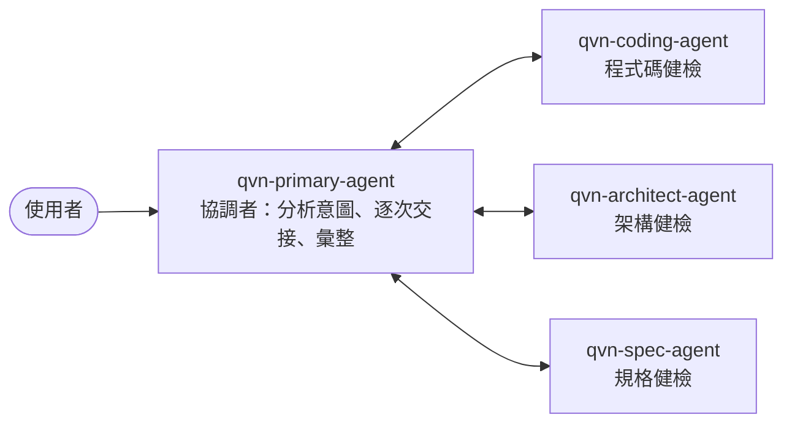

# IPM Multiagent System 技轉工作坊

用 Microsoft Agent Framework 與 Microsoft Foundry，從零建出一個 Multiagent system，並部署到 Foundry hosted agent、發布到 Microsoft Teams。

**對象**：有 Python 基礎、AI 代理人基礎觀念的 AI 開發者

---

## 邏輯架構



**定義檔是唯一事實來源。** `src/agents/` 的內容同時餵給持久化 agent 與執行期參與者，
兩邊不會分歧。

---

## 課程結構

| 講義                                                      | 內容                           |
| --------------------------------------------------------- | ------------------------------ |
| [00 Lab 0：環境驗證](docs/00-lab0-env-check.md)           | 環境、權限、`.env`、preflight  |
| [01 Lab 1：單一 Agent](docs/01-lab1-single-agent.md)      | 在 portal 手動建立第一個 agent |
| [02 Lab 2：多代理與 Handoff](docs/02-lab2-multi-agent.md) | 程式碼建立、拓撲、DevUI        |
| [03 Lab 3：部署到 Azure](docs/03-lab3-deploy.md)          | 容器化、`azd`、traces          |
| [04 Lab 4：發布到 Teams](docs/04-lab4-publish-teams.md)   | Direct publish、1:1 對話       |
| [05 收尾與清理](docs/05-cleanup.md)                       | 刪資源、誠實揭露               |
| [06 如果你卡住了](docs/06-fallback.md)                    | 觀摩路徑與會後重跑（備援）     |

[solutions/](solutions/README.md) 提供各 lab 的完成版，複製覆蓋即可繼續。

---

## 專案結構

```text
src/
├── agents/          Lab 1・2     四個 agent 的定義檔（唯一事實來源）
├── models/          Lab 1・2     結構化輸出的資料模型
├── workflows/       Lab 2        Handoff 拓撲
├── registry/        Lab 2・收尾  agent 的建立與清理腳本
├── preflight/       Lab 0        六項環境檢查
├── fixtures/        Lab 2・3     12 題測試題組
├── config.py        Lab 2・3     環境設定的載入與驗證
└── main.py          Lab 2・3     DevUI 與 Responses 兩種進入點

deploy/              Lab 3・4     部署資產（Dockerfile、azd、agent manifest、infra）
docs/                全程         講義
solutions/           備援         各關完成版（救援用）
```

各 Lab 會用到的指令：

| 關卡  | 你會用到                                                                           |
| ----- | ---------------------------------------------------------------------------------- |
| Lab 0 | `uv run python -m preflight`                                                       |
| Lab 1 | 從 `agents/coding.py` 取 instructions、從 `models/specialist_review.py` 取輸出格式 |
| Lab 2 | `uv run python -m registry.create_agents`、`uv run python main.py`（DevUI）        |
| Lab 3 | `azd provision`、`azd deploy`（容器內跑的是 `main.py --responses`）                |
| Lab 4 | Foundry portal 發布，加上 `azd ai agent show` 確認狀態                             |
| 收尾  | `uv run python -m registry.cleanup`、`azd down`                                    |

---

## 環境變數

放在 `src/.env`（從 `src/.env.template` 複製）：

| 變數                       | 說明             | 從哪裡拿                                                           |
| -------------------------- | ---------------- | ------------------------------------------------------------------ |
| `FOUNDRY_PROJECT_ENDPOINT` | Foundry 專案端點 | portal → 你的專案 → 首頁 → 複製「專案端點」                        |
| `MODEL_DEPLOYMENT_NAME`    | 模型部署名稱     | portal → 你的專案 → Deployments → 複製「部署名稱」（不是模型型號） |

切換環境**只需要改 `.env`**，程式碼與講義都不用動。

---

## 本機執行

### 環境檢查

```bash
cd src
uv run python -m preflight
```

六項全過再往下。詳見 [Lab 0：環境驗證](docs/00-lab0-env-check.md)。

### 建立 agent

```bash
cd src
uv run python -m registry.create_agents
```

> 這支腳本**不會**建立 `qvn-coding-agent`——那是 Lab 1 在 Foundry portal 手動建立的。

### 啟動 DevUI

```bash
cd src
uv run python main.py
```

執行後，在瀏覽器輸入：`http://localhost:8080`。

畫面上會有**兩個**項目，它們是同一套四代理系統的兩種呈現：

| 實體                      | DevUI 類別 | 畫面長什麼樣                       |
| ------------------------- | ---------- | ---------------------------------- |
| `qvn-ipm-review`          | `agent`    | 一個聊天框（Lab 3 部署出去的樣子） |
| `qvn-ipm-review-workflow` | `workflow` | 一張拓撲圖加上 Execution Timeline  |

用來展示 DevUI 同時支援 agent 與 workflow 兩種類別。
兩者有**已知限制**（狀態會跨對話殘留、圖上的線不等於可交接對象），
詳見 [Lab 2](docs/02-lab2-multi-agent.md) 的說明。

> ⚠️ DevUI 以 `auth_enabled=False` 啟動，這是 **不是適用於正式環境**。
> 瀏覽器顯示 400 時改用 `uv run python main.py --forward`。

### 確認拓樸

不確定拓樸是不是你以為的那樣時，直接列出每位 agent 允許交接的對象：

```bash
cd src
uv run python -c "
import asyncio
from azure.identity.aio import AzureCliCredential
from config import load_settings_or_exit
from workflows.handoff import create_workflow

async def main():
    s = load_settings_or_exit()
    async with AzureCliCredential() as cred:
        wf = create_workflow(s.foundry_project_endpoint, s.model_deployment_name, cred)
        for e in wf.get_executors_list():
            print(f'{e.id:22} -> {sorted(e._handoff_targets)}')
asyncio.run(main())
"
```

三位專家的可交接對象都只有 `qvn-primary-agent`——專家之間沒有直接邊。

---

## 部署

```bash
cd deploy
azd env new ipm-workshop
uv run --project ../src python scripts/configure_azd_env.py
azd provision
azd deploy
azd ai agent show
```

匯入工具會從已驗證的 `src/.env` 取得專案端點與模型部署名稱，再透過目前的 Azure CLI 登入自動查出訂閱、租戶、資源群組、區域、Foundry 帳戶、專案名稱及 ARM ID；不需回 portal 手動抄值。

完整步驟與常見失敗見 [Lab 3](docs/03-lab3-deploy.md)。

基礎設施刻意極小：只建立一個 Container Registry 與必要授權。
**不會**佈建 Foundry 專案或模型部署——那是你的既有資產。

---

## 發布到 Teams

Foundry portal → Agents → `qvn-ipm-review` → **Publish**
→ **Teams and Microsoft 365 Copilot** → **Direct publish** → **「Just you」**。

完整步驟見 [Lab 4](docs/04-lab4-publish-teams.md)。

⚠️ **僅支援 1:1 私訊**。頻道提及與群組聊天不支援。

---

## 清理

```bash
cd src
uv run python -m registry.cleanup            # 先看要刪什麼
uv run python -m registry.cleanup --confirm  # 真的刪
```

Container Registry 與 Bot Service 要另外處理，見 [收尾與清理](docs/05-cleanup.md)。

---

## 疑難排解

各講義末尾都有「常見失敗」表。最常見的幾個：

| 現象                              | 處理                                                             |
| --------------------------------- | ---------------------------------------------------------------- |
| preflight 說權限不足              | 訂閱 Owner **不包含** `Foundry Project Manager`，要另外指派      |
| 找不到 `qvn-coding-agent`         | `.env` 指向的專案與 portal 上的不同；比對錯誤訊息裡的 agent 清單 |
| DevUI 顯示 400 Bad Request        | 改用 `uv run python main.py --forward`                           |
| 部署後 `azd ai agent show` 回 404 | `azure.yaml` 的服務名稱必須等於 `agent.yaml` 的 `name`           |
| 休息後第一則訊息很慢              | 閒置 15 分鐘被回收，冷啟動中；不是壞掉                           |
| 改版後行為還是舊的                | `azd ai agent sessions delete <id>`；只開新對話不夠              |

環境本身修不好時走 [觀摩路徑](docs/06-fallback.md)。

---

## 版本

所有相依都**釘死版本**。升級任一 `agent-framework` 套件時，
**必須**重跑 Lab 2 → Lab 3 → Lab 4 全鏈路——
`agent-framework-foundry-hosting` 的版本會決定 `deploy/agent.yaml` 的 protocol 版本號。

### 成熟度：這條鏈路不是每一層都是穩定版

底層的**服務**（Foundry hosted agents）已 GA，**框架核心**（`agent-framework-core`、
`-foundry`、`-orchestrations`）是穩定版——多代理協調這個概念本身站得住腳。

不穩定的是把它接到託管與本機工具的那幾層黏著劑：`agent-framework-devui` 與
`agent-framework-foundry-hosting` 是 **prerelease**，其傳遞相依 `azure-ai-agentserver-*`
**全部 beta**，`azd ai agent` 擴充是 **preview**，建立持久化 agent 用的 `to_prompt_agent()`
標記為 **Experimental**（執行時會印出 `ExperimentalWarning`，那不是錯誤）。

意涵：這條路徑**能用**，但 API 可能在沒有向後相容承諾的情況下變動。
把它當成「現在可行的做法」，不是「長期穩定的介面」。

---

## 參考資料

1. [Microsoft Foundry Agent Service - Overview](https://learn.microsoft.com/en-us/azure/foundry/agents/overview)
2. [Foundry Hosted Agent – Overview](https://learn.microsoft.com/en-us/azure/foundry/agents/concepts/hosted-agents?view=foundry)
3. [Microsoft Agent Framework – Overview](https://learn.microsoft.com/en-us/agent-framework/overview/?pivots=programming-language-python)
4. [Hands-on Lab: Microsoft Agent Framework with Microsoft Foundry](https://moaw.dev/workshop/gh:microsoft/hands-on-lab-agent-framework-with-microsoft-foundry/main/docs/) (300分鐘)
5. [Hands-on Lab: Develop AI Agents in Azure (L300)](https://microsoftlearning.github.io/mslearn-ai-agents/) (360分鐘)

---

## 授權

見 [LICENSE](LICENSE)。

---

Happy coding 💜
